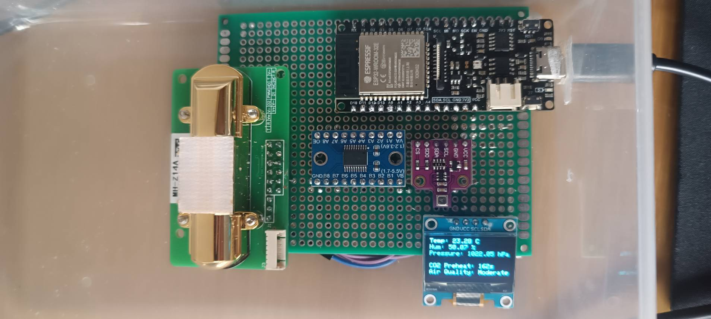
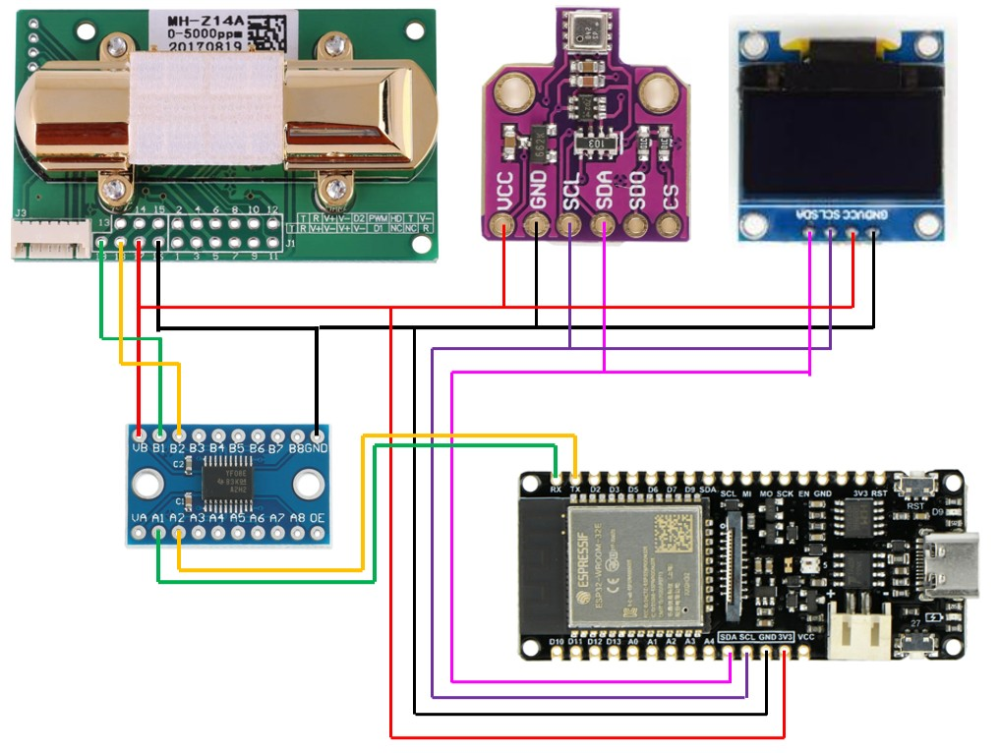

# Hardware
*By Ahmed Gaber Younes Mohamed*

---

## Introduction  
Air quality monitoring is essential in today's world to ensure the health and well-being of individuals in various environments. This project utilizes an array of advanced sensors and components to build an efficient air quality monitoring system. The system measures CO2 concentration, temperature, humidity, air pressure, and other air quality parameters, and displays the results in real time on an OLED screen.  

This report delves into the design and implementation of the project, including detailed explanations of the components, their specifications, system connections, and the integration of security protocols for reliable data acquisition and transmission.  

---

## Components and Their Specifications  

### 1. MH-Z14A CO2 Sensor  
The MH-Z14A is a high-performance NDIR (Non-Dispersive Infrared) CO2 sensor that measures CO2 concentrations ranging from 0 to 5000 ppm.  

**Specifications:**  
- Operating Voltage: 4.5V\u20135.5V  
- Signal Output: PWM, UART, and Analog  
- Accuracy: ±50 ppm + 3% of reading  
- Warm-up Time: 3 minutes  
- Power Consumption: < 150mA  
- Communication Protocol: UART (9600 baud rate)  

**Operation:**  
The MH-Z14A works on the principle of infrared absorption, where CO2 molecules absorb specific IR wavelengths. The sensor outputs data via UART, which is ideal for integration with microcontrollers.  

### 2. BME680 Sensor  
The BME680 is an environmental sensor capable of measuring temperature, humidity, pressure, and air quality (VOC\u2014Volatile Organic Compounds).  

**Specifications:**  
- Operating Voltage: 1.7V\u20133.6V  
- Communication Protocol: I2C and SPI  
- Temperature Range: -40\u00b0C to +85\u00b0C  
- Humidity Range: 0% to 100%  
- Power Consumption: Ultra-low-power modes available  

**Operation:**  
The BME680 uses gas, humidity, and temperature sensing technologies to monitor environmental air quality. Its I2C interface enables seamless communication with the ESP-32E.  

### 3. OLED Display  
A compact 0.96-inch OLED (Organic Light-Emitting Diode) is used to visualize real-time data.  

**Specifications:**  
- Resolution: 128x64 pixels  
- Operating Voltage: 3.3V\u20135V  
- Communication Protocol: I2C (default)  

**Operation:**  
The OLED renders text and graphical elements based on data received from the ESP-32E. Its energy efficiency and crisp display make it suitable for IoT projects.  

### 4. ESP-32E Microcontroller  
The ESP-32E is a low-power microcontroller featuring integrated Wi-Fi and Bluetooth connectivity, making it ideal for IoT applications.  

**Specifications:**  
- Operating Voltage: 3.3V  
- Wi-Fi Standard: 802.11 b/g/n  
- CPU: Dual-core Tensilica LX6  
- Flash Memory: 32Mbit  
- GPIO Pins: 34  
- Communication Protocols: UART, I2C, SPI  

**Operation:**  
The ESP-32E processes sensor data and communicates with the OLED for display purposes. Its Wi-Fi capability allows future expansions such as cloud integration or mobile app connectivity.  

### 5. TXS0108E Logic Level Converter  
This bidirectional level shifter facilitates communication between the 5V MH-Z14A sensor and the 3.3V ESP-32E.  

**Specifications:**  
- Operating Voltage: 1.2V\u20133.6V (Low side), 1.65V\u20135.5V (High side)  
- Number of Channels: 8  

**Operation:**  
The TXS0108E ensures safe voltage translation, preventing damage to the ESP-32E from the higher voltage signals of the MH-Z14A.  

---

## Connections and System Design  

### Wiring Diagram  
Below is a simplified explanation of how the components are connected:  

1. **MH-Z14A CO2 Sensor:**  
   - VCC connected to a TXS0108E high-voltage side.  
   - GND connected to the ESP-32E & TXS0108E ground.  
   - TX (UART) connected to the TXS0108E high-voltage side.  
   - RX (UART) connected via the TXS0108E to the ESP-32E's UART pins.  

2. **BME680 Sensor:**  
   - VCC connected to the ESP-32E 3.3V pin.  
   - GND connected to the ESP-32E ground.  
   - SCL and SDA connected to the I2C pins (SCL, SDA, respectively) of the ESP-32E.  

3. **OLED Display:**  
   - VCC connected to 3.3V.  
   - GND connected to ground.  
   - SCL and SDA connected to the same I2C lines as the BME680.  

4. **TXS0108E Level Shifter:**  
   - High-side power supply connected to V+ MH-Z14A.  
   - Low-side power supply connected to 3.3V from the ESP-32E.  
   - UART lines from MH-Z14A and ESP-32E routed through corresponding high and low sides of the shifter.  

---

## Security Protocols  

### Data Integrity  
1. **Error Checking:** Implement checksum validation for UART communication between the MH-Z14A and ESP-32E.  
2. **I2C Protocol:** Use pull-up resistors for I2C lines to reduce noise and ensure reliable communication.  

### Voltage Regulation  
The TXS0108E ensures proper voltage levels to prevent electrical damage.  

### Signal Encryption  
Wi-Fi communication uses WPA2 security for encrypted data transmission.  

---

## Testing and Calibration  

- **Sensor Calibration:** Both the MH-Z14A and BME680 have been calibrated in a controlled environment to ensure accuracy.  
- **System Testing:** Conducted stress tests to verify stability under varying environmental conditions, including humidity and temperature extremes.  

---

## Conclusion  
This air quality monitoring system combines robust sensors, efficient data processing, and future scalability. By integrating security protocols and optimizing hardware connections, the system ensures reliable and accurate environmental monitoring, with the potential for further upgrades such as cloud connectivity and mobile interfaces.  

---

## Appendix  

### Table 1: Connections  
| Component    | Connected To   | Component Pin | ESP Pin  |  
|--------------|----------------|---------------|----------|  
| **BME680**   | **ESP**        | VCC           | Vin      |  
|              |                | GND           | GND      |  
|              |                | SCL           | SCL      |  
|              |                | SDA           | SDA      |  
| **OLED**     | **ESP**        | VCC           | Vin      |  
|              |                | GND           | GND      |  
|              |                | SCL           | SCL      |  
|              |                | SDA           | SDA      |  
| **TXS0108E** & **MH-Z14A** | **ESP + MHZ** | TXS GND   | ESP GND |  
|              |                | VA            | Vin      |  
|              |                | A1            | TX       |  
|              |                | A2            | RX       |  
|              | **MHZ Pin**    | VB            | V+       |  
|              |                | B1            | RX       |  
|              |                | B2            | TX       |  

*TXS0108E is used to convert 3.3V to 5V, which is required to operate the CO2 sensor.*  
