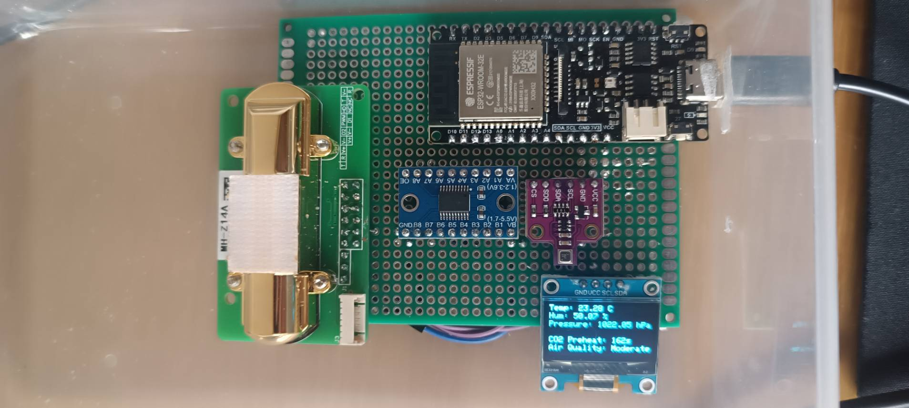

# Pure Sense (IIoT) 

## Project Description
PureSense is a compact, portable air quality monitoring system designed to measure and display real-time environmental data, including CO₂ levels, temperature, humidity, air pressure, and VOCs. Developed as part of an IIoT course at Taiwan Tech, the project integrates advanced sensors with an ESP32 microcontroller and a sleek OLED display for local and remote monitoring. The system emphasizes accuracy, energy efficiency, and user-friendliness, offering reliable insights into indoor air quality through both standalone operation and connectivity with platforms like Blynk for extended functionality.

## Problem Statement

[Go to Problem Statement Documentation](ProblemStatement.md)

Overcrowding in public transportation during peak hours creates stressful and uncomfortable environments while significantly degrading air quality due to poor ventilation and high passenger density. Elevated levels of CO₂, VOCs, and humidity in these confined spaces lead to health risks, particularly for vulnerable groups such as children, the elderly, and individuals with respiratory conditions. This not only impacts commuter well-being but also discourages public transportation use, exacerbating urban congestion and pollution. Real-time air quality monitoring is essential to address these challenges by enabling timely interventions, improving ventilation, and fostering a healthier commuting experience.

## Website
The PureSense website serves as a comprehensive platform to promote our air quality monitoring system. 
It provides:

- Detailed feature descriptions of the hardware and software components.  
- A contact section for technical support and inquiries.  
- A team introduction, showcasing the contributors and their roles in the development process.  

Visit [PureSense Website](https://iiotpuresense.wixsite.com/home) for detailed insights.

---

## About Us  
We are a group of five individuals developing an air quality monitoring tool as part of our IIoT course at Taiwan Tech (National Taiwan University of Science).  

### Team Responsibilities
| **Name**               | **Student ID** | **Job Description**                                |
|-------------------------|----------------|---------------------------------------------------|
| Zephaniah Irwan        | M11251801     | Project Coordinator |
| Ahmed Gaber Younes Mohamed | M11207824     | Hardware Specialist |
| Salma              | M11202814     | Software Specialist |
| Lina Wang              | D11251001     | Marketing Strategist |
| Katharina Joksch           | E11309005     | Website Designer & GitHub  |

---

## Hardware
[Go to Hardware Documentation](Hardware.md)

### Components  
The PureSense system is built using the following components:  
- **MH-Z14A CO₂ Sensor:** Measures CO₂ concentrations (0–5000 ppm) with high precision.  
- **BME680 Sensor:** Detects temperature, humidity, air pressure, and VOC levels.  
- **ESP32 Microcontroller:** Handles data processing and wireless connectivity.  
- **OLED Display:** Provides real-time visualization of environmental data.  
- **TXS0108E Level Converter:** Ensures safe communication between sensors and the microcontroller.  

### Architecture  
The system integrates all components to provide seamless monitoring. The ESP32 processes sensor data and displays it on an OLED screen. Data can also be transmitted wirelessly via Wi-Fi for remote monitoring through platforms like Blynk. The robust hardware design ensures portability and reliability, with a focus on low power consumption.

---

## Software
[Go to Software Documentation](Software.md)

The PureSense software is developed using the Arduino IDE and integrates libraries for the ESP32, BME680, and OLED display. Key functionalities include:  
- **Real-time Data Visualization:** Display environmental data on the OLED screen.  
- **Remote Monitoring:** Use the Blynk platform for web and mobile data access.  
- **Configurable Settings:** Easy updates for Wi-Fi and Blynk credentials.  
The software ensures efficient operation with low power consumption and scalability for future features like cloud integration.

---

## Marketing  
[Go to Marketing Documentation](Marketing.md)  

The marketing strategy for PureSense focuses on showcasing its unique value propositions, including cost efficiency, high precision, and portability. Key initiatives include:  
- **Differentiation:** Highlighting superior accuracy and faster response times compared to competitors.  
- **Partnerships:** Collaborations with industries, online influencers, and participation in trade shows.  
- **Online Presence:** Promoting through social media and sharing customer success stories.  
This approach aims to enhance brand visibility, build credibility, and drive adoption in target markets such as schools, hospitals, and smart homes.
